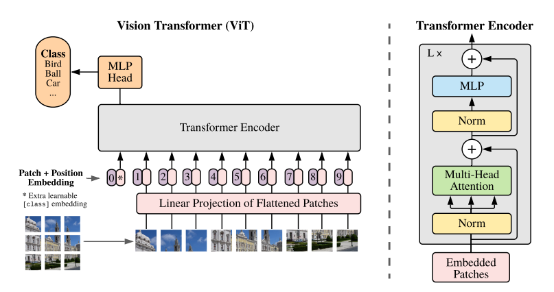

## **Vision Transformer Paper Implementation**

In this Vision Transformer implementation, I developed all of the key components of the model from scratch, such as the Multi-head Self-attention mechanism and Transformer layers. By scratch, I mean only using PyTorch
components and not the ready-to-use modules such as *Torch.nn.TransformerEncoderLayer*. 

I used the original Vision Transformer paper's model architecture:  

The model was trained on the CIFAR-10 dataset with these specific configurations:
- Image patch width/height: 4 pixels
- Patch embeddings: 512 dimensions
- Heads in Multi-head Self-attention layers: 4
- Number of Transformer layers in the Transformer Encoder: 4
- Dropout probability: 0.0

The best model's accuracy on the test dataset is 77.87%. A lower performance was expected as the paper informed me that Convolutional and Residual Networks have 
a lower inductive bias, and the way the researchers counteracted this inherent deficiency was by pre-training their vision transformer on extremely large datasets
such as ImageNet and JFT. 

## **References**  
Vision Transformer Paper - https://arxiv.org/abs/2010.11929
